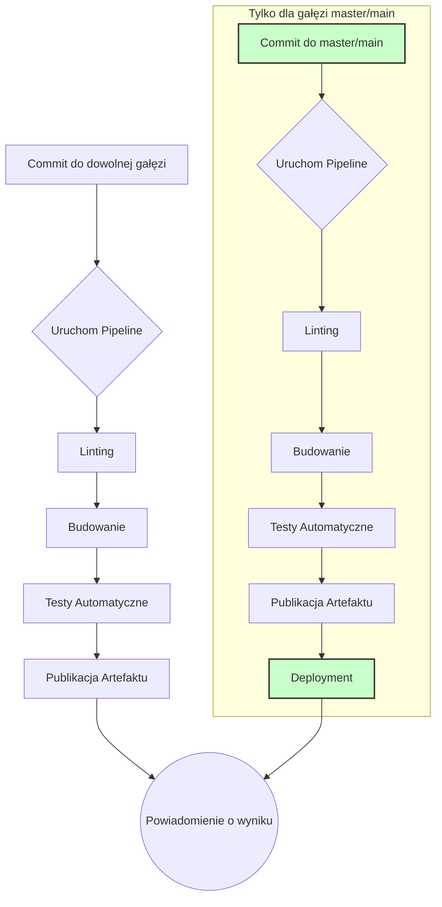
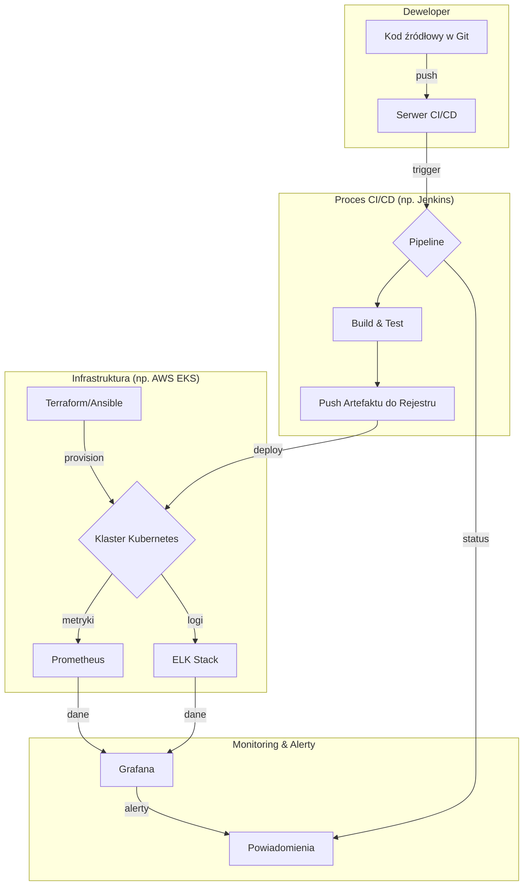

# Wymagania Projektu Dyplomowego - DevOps

## Główne Cele Projektu

> [!NOTE] Główne zadania
> 
> W ramach projektu dyplomowego należy zrealizować następujące cele:
> 
> 1. **Wybór Repozytorium:** Wybrać publicznie dostępne repozytorium (lub kilka) z kodem źródłowym aplikacji (mono- lub mikroserwisowej).
>     
> 2. **Fork/Kopia:** Stworzyć fork lub lokalną kopię wybranego repozytorium.
>     
> 3. **Automatyzacja Infrastruktury (IaC):** Zautomatyzować proces tworzenia infrastruktury pod wdrożenie projektu.
>     
> 4. **Automatyzacja CI/CD:** Zautomatyzować procesy ciągłej integracji i ciągłego dostarczania.
>     
> 5. **Monitoring:** Skonfigurować monitoring dla infrastruktury oraz aplikacji.
>     

## Kryteria Zaliczenia

> [!SUCCESS] Warunki konieczne do spełnienia
> 
> - **Dokumentacja:** Repozytorium musi zawierać minimalną dokumentację opisującą jego zawartość oraz procesy budowania i wdrażania.
>     
> - **Infrastruktura jako Kod (IaC):** Infrastruktura musi być możliwa do wdrożenia od zera za pomocą **jednej komendy**.
>     
> - **Procesy CI/CD:**
>     
>     - **Commit do dowolnej gałęzi:** Musi uruchamiać etapy:
>         
>         - ✅ Sprawdzanie kodu (linting)
>             
>         - ✅ Budowanie aplikacji
>             
>         - ✅ Testy automatyczne
>             
>         - ✅ Publikacja artefaktów w repozytorium (np. Nexus, Artifactory, Docker Hub)
>             
>     - **Commit do głównej gałęzi (master/main):** Musi dodatkowo uruchamiać automatyczne wdrożenie (deployment) na docelową infrastrukturę.
>         
>     - **Powiadomienia:** System musi wysyłać powiadomienia o wyniku budowania i wdrożenia do wybranego kanału komunikacji (e-mail, czat).
>         

### Wizualizacja Procesu CI/CD

## Opcjonalne Ulepszenia Projektu

> [!TIP] Dodatkowe możliwości
> 
> - **Bezpieczeństwo:** Implementacja SSL/TLS.
>     
> - **Skalowalność:** Uruchomienie wielu replik jednego serwisu z użyciem load balancera.
>     
> - **Konteneryzacja:** Użycie Dockera do spakowania aplikacji.
>     
> - **Orkiestracja:** Wykorzystanie Kubernetesa jako docelowej infrastruktury.
>     
> - **Testy:** Rozszerzenie o dodatkowe rodzaje testów (integracyjne, wydajnościowe).
>     
> - **Pełna Automatyzacja:** Automatyczna konfiguracja wszystkiego od zera (włącznie z CI/CD i monitoringiem).
>     
> - **Agregacja Logów:** Implementacja centralnego systemu zbierania logów (np. ELK Stack).
>     
> - **Dokumentacja Kodu:** Użycie narzędzi do generowania dokumentacji bezpośrednio z kodu.
>     

## Stos Technologiczny

> [!INFO] Sugerowane narzędzia
> 
> - **Infrastruktura:**
>     
>     - **IaC:** Terraform, Ansible
>         
>     - **Chmura/Wirtualizacja:** AWS, Vagrant
>         
>     - **Konteneryzacja:** Docker
>         
>     - **Orkiestracja:** Amazon EKS (Kubernetes)
>         
> - **CI/CD:**
>     
>     - **Serwer:** Jenkins, GitHub Actions
>         
> - **Powiadomienia:**
>     
>     - Email, Telegram, Slack, Discord
>         
> - **Monitoring:**
>     
>     - **Metryki:** Prometheus
>         
>     - **Wizualizacja:** Grafana
>         
> - **Logowanie:**
>     
>     - **Stack:** ELK (Elasticsearch, Logstash, Kibana)
>         

### Schemat Architektury

## Warunki Prowadzącego

> [!WARNING] Doprecyzowania i ograniczenia
>
> 1. **Kubernetes:** K8s w dowolnej platformie, nie musi to być AWS. W miarę możliwości nie używać minikube.
>
> 2. **IaC / Terraform:** Zgodnie z dobrymi praktykami — moduły, struktura, itp.
>
> 3. **CI/CD:** Dowolne narzędzie, nie musi być Jenkins — z zachowaniem standardów: validate, build, deploy.
>
> 4. **Pipeline'y:** Infrastruktura i Aplikacja mogą być w osobnych pipeline'ach, jednak commit/PR powoduje uruchomienie pipeline'a. Apply czeka na zatwierdzenie przez użytkownika.
>
> 5. **Aplikacja:** Dowolna gotowa aplikacja ("Hello world") — nie piszecie nic na potrzeby tego zadania.
>
> 6. **Observability / Monitoring:** Może być z użyciem innego stacka niż Grafana + Prometheus + ELK — jednak przy zachowaniu odpowiednich standardów/praktyk. Wymagana forma powiadomień o alarmie (np. mail).

Realizacja powyższych wymagań w projekcie opisana jest w [[architektura|Architekturze Docelowej Rozwiązania]] oraz w dokumentacji poszczególnych etapów w folderze `środowisko`.

## Obrona Projektu

> [!ABSTRACT] Struktura prezentacji
> 
> 1. **Wprowadzenie (3-5 min):**
>     
>     - Krótki opis projektu.
>         
>     - Zastosowane narzędzia.
>         
>     - Podsumowanie wykonanej pracy i osiągniętych rezultatów.
>         
> 2. **Demonstracja (10-12 min):**
>     
>     - Praktyczny pokaz działania pipeline'u CI/CD (od commita do wdrożenia).
>         
> 3. **Pytania i Dyskusja (5-7 min):**
>     
>     - Sesja Q&A.
>         

## Przykładowe Repozytoria Aplikacji

> [!EXAMPLE] Repozytoria startowe
> 
> - **Golang Hello World:** [github.com/hackersandslackers/golang-helloworld](https://github.com/hackersandslackers/golang-helloworld "null")
>     
> - **Java Maven App:** [github.com/jenkins-docs/simple-java-maven-app](https://github.com/jenkins-docs/simple-java-maven-app "null")
>     
> - **Java Gradle App:**
>     
>     - [github.com/jitpack/gradle-simple](https://github.com/jitpack/gradle-simple "null")
>         
>     - [github.com/jhipster/jhipster-sample-app-gradle](https://github.com/jhipster/jhipster-sample-app-gradle "null")
>         
> - **Calculator App (różne technologie):** [github.com/HouariZegai/Calculator](https://github.com/HouariZegai/Calculator "null")
>