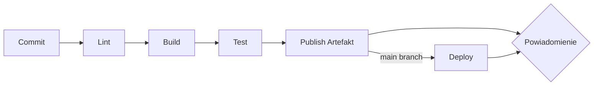

# CI/CD — Pipeline

## Narzędzia

| Komponent | Narzędzie | Wersja |
|---|---|---|
| SCM | {{GitHub / GitLab / ...}} | |
| CI/CD Engine | {{GitHub Actions / Jenkins / ...}} | |
| Artefakt Registry | {{Nexus / Artifactory / Docker Hub / ...}} | |
| Powiadomienia | {{Email / Slack / Telegram / Discord}} | |

---

## Triggery Pipeline'a

| Trigger | Pipeline | Opis |
|---|---|---|
| Commit do dowolnej gałęzi | `validate` | Lint + Build + Test + Publish |
| Commit do `main`/`master` | `validate` → `deploy` | To co wyżej + Deployment |
| Pull Request | `validate` | Weryfikacja przed merge |

---

## Etapy Pipeline'a

### 1. Linting

- **Narzędzie:** {{ESLint / Super-Linter / ...}}
- **Konfiguracja:** `{{ścieżka do pliku config}}`
- **Kryterium fail:** Warnings / errors

### 2. Budowanie (Build)

- **Narzędzie:** {{Maven / Gradle / Docker / ...}}
- **Komenda:** `{{polecenie}}`
- **Output:** {{JAR / Docker image / ...}}

### 3. Testy Automatyczne

| Typ testów | Narzędzie | Komenda |
|---|---|---|
| Jednostkowe | | |
| Integracyjne | | |
| (opcjonalnie) | | |

### 4. Publikacja Artefaktów

- **Repozytorium:** {{Nexus / Docker Hub / ...}}
- **Tag:** `{{latest | ${GIT_SHA} | ${VERSION}}}`

### 5. Deployment (tylko `main`/`master`)

- **Narzędzie:** {{Helm / kubectl / ...}}
- **Strategia:** {{Rolling update / Blue-green / ...}}
- **Zatwierdzenie:** {{Automatyczne | Manualne (apply czeka na approve)}}

---

## Powiadomienia

| Kanał | Zdarzenie | Odbiorcy |
|---|---|---|
| {{Email}} | Build failure / success | {{zespół}} |
| {{Slack}} | Deployment completed | {{#kanał}} |

---

## Pliki konfiguracyjne

| Plik | Opis |
|---|---|
| `{{.github/workflows/ci.yml}}` | Główny pipeline CI |
| `{{Jenkinsfile}}` | Pipeline dla Jenkins |
