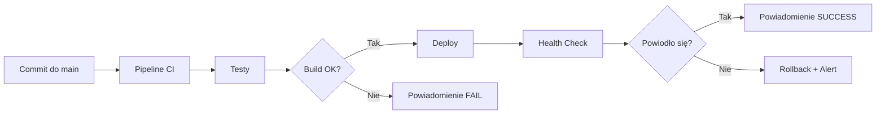

# Deployment — Runbook

## Wymagania wstępne

- [ ] Dostęp do klastra Kubernetes (`kubectl` skonfigurowany)
- [ ] Docker / Helm (jeśli używany)
- [ ] Credentiale do registry artefaktów
- [ ] Zatwierdzenie deploymentu (jeśli wymagane)

---

## Procedura Deploymentu

### 1. Weryfikacja przedwdrożeniowa

```bash
kubectl cluster-info
kubectl get nodes
kubectl get pods -A
```

### 2. Deployment aplikacji

```bash
kubectl apply -f {{ścieżka/manifest.yaml}}
# lub
helm upgrade --install {{release}} {{chart}} --namespace {{ns}} --values {{values.yaml}}
```

### 3. Weryfikacja wdrożenia

```bash
kubectl get pods -n {{namespace}} -w
kubectl get svc -n {{namespace}}
kubectl logs -n {{namespace}} deployment/{{nazwa}}
```

### 4. Health Check

```bash
curl -f {{URL_HEALTH_ENDPOINT}}
```

---

## Rollback

### Procedura awaryjna

```bash
# Helm rollback
helm rollback {{release}} --namespace {{namespace}}

# kubectl rollback
kubectl rollout undo deployment/{{nazwa}} -n {{namespace}}
```

### Kryteria uruchomienia rollbacku

- Błędy 5xx po wdrożeniu > {{X}}%
- CrashLoopBackOff na nowych podach
- Niepowodzenie testów smoke

---

## Weryfikacja powdrożeniowa (Smoke Tests)

```bash
# Przykładowe testy
curl -s {{URL}} | jq .
curl -s {{URL}}/health
```

---

## Deployment z CI/CD

Deployment jest automatycznie wyzwalany przez commit do gałęzi `main`/`master` i realizowany przez pipeline opisany w [CI-CD - Pipeline](CI-CD%20-%20Pipeline.md).


