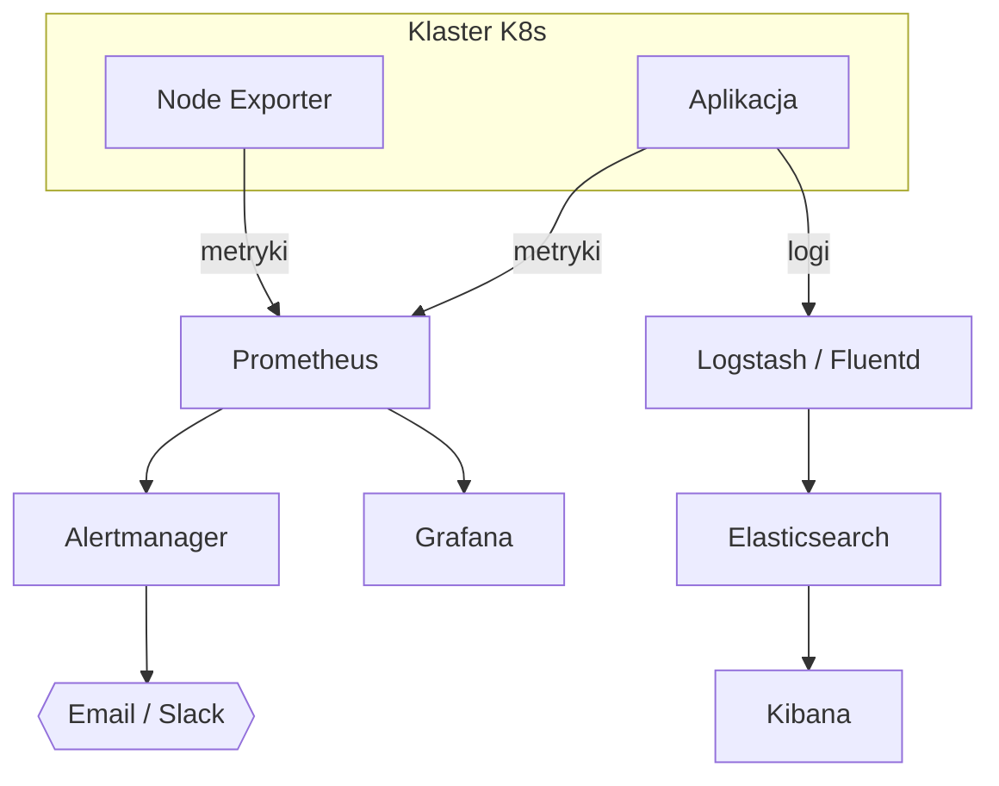

# Monitoring — Stack

## Wybrany Stack

| Komponent | Narzędzie | Wersja | Przeznaczenie |
|---|---|---|---|
| Metryki | {{Prometheus / ...}} | | Zbieranie metryk |
| Wizualizacja | {{Grafana / ...}} | | Dashboardy |
| Logi | {{ELK / Loki / ...}} | | Centralne logowanie |
| Alerty | {{Alertmanager / ElastAlert / ...}} | | Powiadomienia alarmowe |

---

## Architektura Monitoringu

---

## Metryki

### Infrastruktura

| Metryka | Źródło | Cel |
|---|---|---|
| CPU usage | Node Exporter | |
| Memory usage | Node Exporter | |
| Disk usage | Node Exporter | |
| Network I/O | Node Exporter | |

### Kubernetes

| Metryka | Źródło | Cel |
|---|---|---|
| Pod status | kube-state-metrics | |
| Deployment replicas | kube-state-metrics | |
| Node conditions | kube-state-metrics | |

### Aplikacja

| Metryka | Źródło | Cel |
|---|---|---|
| HTTP 5xx rate | App metrics | |
| Request latency | App metrics | |
| Request rate | App metrics | |

---

## Dashboardy Grafana

| Dashboard | ID / Źródło | Opis |
|---|---|---|
| Node Exporter Full | 1860 | Stan węzłów |
| Kubernetes Cluster | 315 | Przegląd klastra |
| {{Aplikacja}} | {{custom}} | Metryki aplikacyjne |

---

## Reguły Alertowe

| Nazwa alertu | Warunek | Czas trwania | Severity | Kanał |
|---|---|---|---|---|
| High CPU | `cpu > 80%` | 5 min | warning | Email |
| Pod CrashLoop | `pod restart > 3` | 1 min | critical | Email + Slack |
| Disk Full | `disk > 90%` | 5 min | critical | Email |

---

## Powiadomienia Alarmowe

| Kanał | Konfiguracja |
|---|---|
| Email | SMTP: {{host:port}}, od: {{adres}} |
| Slack/Discord | Webhook URL |

---

## Logi

### Źródła logów

| Źródło | Typ | Kolektor |
|---|---|---|
| Aplikacja | JSON / plain | Fluentd |
| K8s events | — | Fluentd |
| System (syslog) | — | Fluentd |

### Retencja

- **Logi aplikacyjne:** {{30 dni}}
- **Logi systemowe:** {{14 dni}}
