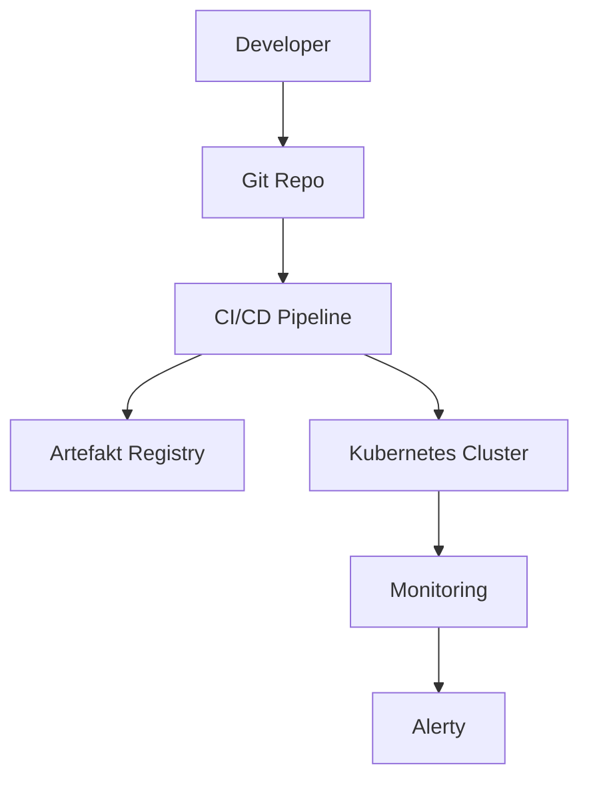

# {{Nazwa Projektu}}

Krótki opis projektu — czym jest, co robi, w jakim celu powstał.

---

## Spis Treści

- [Opis projektu](#opis-projektu)
- [Architektura](#architektura)
- [Wymagania](#wymagania)
- [Struktura repozytorium](#struktura-repozytorium)
- [Jak zbudować lokalnie](#jak-zbudować-lokalnie)
- [Jak wdrożyć](#jak-wdrożyć)
- [Dokumentacja](#dokumentacja)

---

## Opis Projektu

{{Rozszerzony opis — kontekst, cel, zakres.}}

---

## Architektura



---

## Wymagania

| Narzędzie | Minimalna wersja |
|---|---|
| Terraform | |
| Ansible | |
| Docker | |
| kubectl | |
| Helm (opcjonalnie) | |

---

## Struktura Repozytorium

```
.
├── app/                    # Kod źródłowy aplikacji
├── iac/                    # Infrastructure as Code
│   ├── terraform/
│   └── ansible/
├── kubernetes/             # Manifesty K8s
├── monitoring/             # Konfiguracja monitoringu
├── ci/                     # Konfiguracja CI/CD (np. .github/workflows/)
├── docs/                   # Dokumentacja
└── README.md
```

---

## Jak Zbudować Lokalnie

```bash
git clone {{URL_REPO}}
cd {{katalog}}

# Build
{{komenda build}}

# Testy
{{komenda test}}

# Uruchom lokalnie
{{komenda run}}
```

---

## Jak Wdrożyć

### Infrastruktura (IaC)

```bash
cd iac/terraform
terraform init
terraform plan
terraform apply
```

### Aplikacja

```bash
# Przez CI/CD (zalecane)
# Commit do main → automatyczny deployment

# Ręcznie
kubectl apply -f kubernetes/
# lub
helm install {{release}} ./charts/{{nazwa}}
```

---

## Dokumentacja

| Dokument | Opis |
|---|---|
| [Wymagania](Wymagania%20Projektu%20Dyplomowego.md) | Wymagania i cele projektu |
| [ADR](szablony/ADR%20-%20Decyzje%20Architektoniczne.md) | Decyzje architektoniczne |
| [Infrastruktura](szablony/Infrastruktura%20-%20Dokumentacja.md) | Specyfikacja infrastruktury |
| [CI/CD Pipeline](szablony/CI-CD%20-%20Pipeline.md) | Opis pipeline'ów CI/CD |
| [Monitoring](szablony/Monitoring%20-%20Stack.md) | Stack monitoringu |
| [Deployment Runbook](szablony/Deployment%20-%20Runbook.md) | Procedura wdrożenia |
| [Troubleshooting](szablony/Troubleshooting.md) | Znane problemy |

---

## Autorzy

- {{Imię Nazwisko}} — Projekt Dyplomowy DevOps

## Licencja

{{MIT / Apache 2.0 / ...}}
