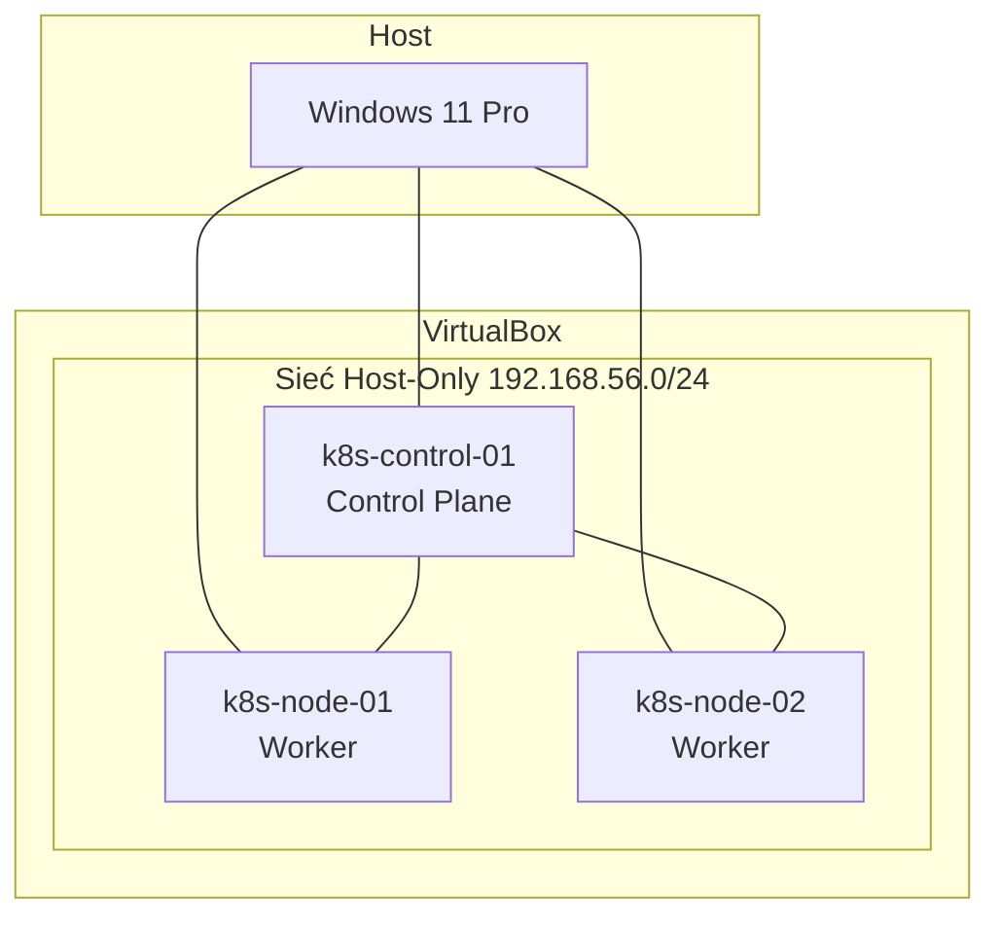
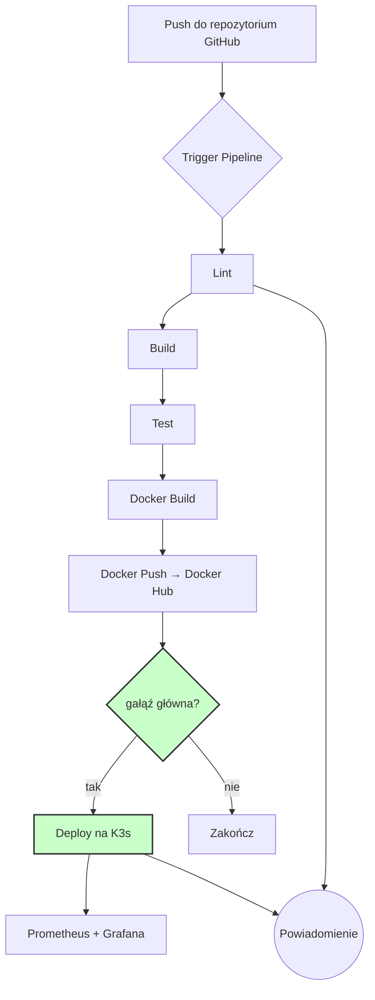

# Architektura Docelowa Rozwiązania

## Założenia Architektoniczne

Projekt realizowany jest zgodnie z praktykami DevOps, obejmującymi:

- Infrastrukturę jako Kod (Infrastructure as Code),
- automatyzację wdrożeń (CI/CD),
- konteneryzację aplikacji,
- orkiestrację kontenerów,
- monitoring infrastruktury i aplikacji.

Ze względu na ograniczenia środowiska laboratoryjnego oraz dostępny czas realizacji projektu, zdecydowano się na wykorzystanie lokalnego klastra Kubernetes uruchomionego na maszynach wirtualnych VirtualBox.

---

## Architektura Logiczna

Docelowa architektura rozwiązania składa się z następujących elementów:

```
Windows 11 Pro
│
└── VirtualBox
    │
    ├── k8s-control-01
    │   ├── K3s Server
    │   └── Ansible
    │
    ├── k8s-node-01
    │   └── K3s Agent
    │
    └── k8s-node-02
        └── K3s Agent

GitHub
└── Repozytorium kodu źródłowego

GitHub Actions
└── Proces CI/CD

Docker Hub
└── Repozytorium obrazów kontenerów

Terraform
├── Namespace
├── Deployment
└── Service

Monitoring
├── Prometheus
└── Grafana
```

---

## Topologia Fizyczna

```
Windows 11 Pro (Host)
│
└── VirtualBox 7.2.8
    │
    ├── k8s-control-01 (Control Plane)
    │   Ubuntu Server 24.04 LTS
    │   2 vCPU / 4 GB RAM / 40 GB
    │
    ├── k8s-node-01 (Worker)
    │   Ubuntu Server 24.04 LTS
    │   2 vCPU / 6 GB RAM / 40 GB
    │
    └── k8s-node-02 (Worker)
        Ubuntu Server 24.04 LTS
        2 vCPU / 6 GB RAM / 40 GB
```

Szczegółowa specyfikacja maszyn znajduje się w [[specyfikacja-maszyn|Specyfikacji Maszyn]].

## Diagram Topologii



---

## Warstwa Infrastruktury

Warstwa infrastruktury składa się z trzech maszyn wirtualnych Ubuntu Server 24.04 LTS.

| Host           | Funkcja                                           |
| -------------- | ------------------------------------------------- |
| k8s-control-01 | Węzeł zarządzający Kubernetes oraz serwer Ansible |
| k8s-node-01    | Węzeł roboczy Kubernetes                          |
| k8s-node-02    | Węzeł roboczy Kubernetes                          |

Maszyny komunikują się poprzez dedykowaną sieć Host-Only utworzoną w VirtualBox (`192.168.56.0/24`). Szczegółowa konfiguracja sieci opisana jest w [[sieć|Konfiguracji Sieci]].

---

## Orkiestracja Kontenerów (K3s)

Jako platformę orkiestracji kontenerów wybrano **K3s** — lekką dystrybucję Kubernetes.

Klaster składa się z:

- jednego węzła Control Plane (`k8s-control-01`),
- dwóch węzłów Worker (`k8s-node-01`, `k8s-node-02`).

K3s zapewnia pełną zgodność z API Kubernetes przy znacznie prostszej instalacji i mniejszych wymaganiach sprzętowych niż standardowa instalacja oparta o kubeadm.

| Komponent | Maszyna | Opis |
|---|---|---|
| K3s Server | `k8s-control-01` | API server, etcd (wbudowany SQLite), scheduler, controller-manager |
| K3s Agent | `k8s-node-01` | kubelet, kube-proxy, container runtime (containerd) |
| K3s Agent | `k8s-node-02` | kubelet, kube-proxy, container runtime (containerd) |

---

## Zarządzanie Konfiguracją (Ansible)

Do automatyzacji konfiguracji serwerów wykorzystany zostanie **Ansible**.

Ansible będzie odpowiedzialny za:

- przygotowanie systemów operacyjnych,
- instalację wymaganych pakietów,
- konfigurację klastra K3s,
- zarządzanie konfiguracją środowiska.

Playbooki będą uruchamiane z serwera:

```
k8s-control-01
```

Szczegółowa konfiguracja Ansible opisana jest w [[konfiguracja-ansible|Konfiguracji Ansible i Komunikacji między Węzłami]].

---

## Repozytorium Kodu (GitHub)

Kod źródłowy aplikacji będzie przechowywany w repozytorium **GitHub**.

Na potrzeby projektu wykorzystana zostanie gotowa aplikacja demonstracyjna zgodnie z wymaganiami projektu.

Repozytorium będzie stanowić źródło dla procesów Continuous Integration oraz Continuous Delivery.

---

## Proces CI/CD (GitHub Actions)

Do realizacji procesów CI/CD wykorzystane zostanie **GitHub Actions**.

Pipeline będzie realizował następujące etapy:

1. Walidacja kodu (linting).
2. Budowanie aplikacji.
3. Uruchamianie testów automatycznych.
4. Budowanie obrazu Docker.
5. Publikacja obrazu w Docker Hub.
6. Automatyczne wdrożenie na klaster Kubernetes.

Dla głównej gałęzi repozytorium proces zakończy się automatycznym wdrożeniem nowej wersji aplikacji.

---

## Infrastruktura jako Kod (Terraform)

Do zarządzania zasobami aplikacyjnymi w klastrze Kubernetes wykorzystany zostanie **Terraform**.

Terraform będzie odpowiedzialny za tworzenie i aktualizację:

- Namespace,
- Deployment,
- Service.

Konfiguracja zostanie przygotowana zgodnie z dobrymi praktykami Terraform, z wykorzystaniem modułów oraz podziału konfiguracji na logiczne komponenty.

---

## Rejestr Obrazów Kontenerowych (Docker Hub)

Obrazy Docker budowane przez pipeline CI/CD będą publikowane w **Docker Hub**.

Docker Hub będzie pełnił funkcję centralnego repozytorium artefaktów aplikacyjnych.

---

## Monitoring i Obserwowalność

Do monitorowania infrastruktury oraz aplikacji wykorzystane zostaną:

| Narzędzie  | Funkcja                          |
| ---------- | -------------------------------- |
| Prometheus | Zbieranie metryk                 |
| Grafana    | Wizualizacja metryk i dashboardy |

Monitoring będzie obejmował:

- stan klastra Kubernetes,
- wykorzystanie zasobów serwerów,
- stan aplikacji,
- dostępność usług.

Planowane jest skonfigurowanie mechanizmu alertowania umożliwiającego wysyłanie powiadomień o wykrytych problemach.

---

## Oczekiwany Przepływ Wdrożenia

Docelowy proces wdrożenia będzie przebiegał według następującego scenariusza:

```
Programista
    │
    ▼
Git Push
    │
    ▼
GitHub Actions
    │
    ├── Lint
    ├── Build
    ├── Test
    ├── Docker Build
    └── Docker Push
             │
             ▼
        Docker Hub
             │
             ▼
       Deployment
             │
             ▼
      Kubernetes (K3s)
             │
             ▼
 Prometheus + Grafana
```

W rezultacie pojedynczy commit do repozytorium będzie inicjował pełny proces budowania, publikacji oraz wdrożenia aplikacji.


