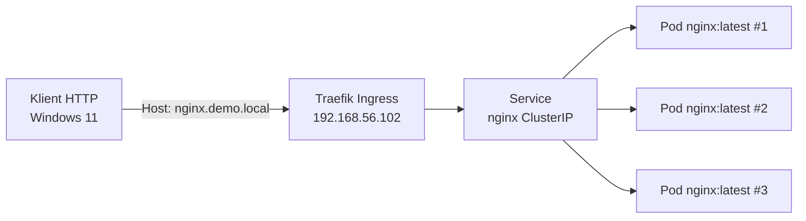

# Podstawowe Obiekty Kubernetes

## Cel

Celem etapu było przejście od działającego klastra K3s do weryfikacji podstawowych obiektów Kubernetes z poziomu aplikacji. Etap stanowi pomost pomiędzy warstwą infrastruktury ([[automatyzacja-k3s-ansible|klastrem K3s]]) a docelowym wdrażaniem aplikacji z pipeline CI/CD.

Etap obejmował utworzenie i obserwację zachowania:

- Namespace,
- Deployment,
- Service (ClusterIP),
- skalowania replik,
- aktualizacji kroczącej (Rolling Update),
- Ingress (Traefik).

> [!INFO] Kontekst
>
> Ten etap kontynuuje prace z [[automatyzacja-k3s-ansible|Automatyzacji K3s przy użyciu Ansible Roles]], gdzie w pełni zautomatyzowany klaster K3s uzyskał status `Ready` na wszystkich węzłach. Manifesty Kubernetes przechowywane są w katalogu `/opt/projekt_devops/kubernetes/`.

---

## Środowisko

| Hostname       | Rola          | Adres IP       | Status |
| -------------- | ------------- | -------------- | ------ |
| k8s-control-01 | Control Plane | 192.168.56.102 | Ready  |
| k8s-node-01    | Worker        | 192.168.56.103 | Ready  |
| k8s-node-02    | Worker        | 192.168.56.104 | Ready  |

Klaster K3s ze zintegrowanym kontrolerem Traefik Ingress.

---

## Namespace

Utworzono izolowaną przestrzeń nazw dla demonstracji:

```bash
kubectl create namespace demo
```

Weryfikacja:

```bash
kubectl get namespaces
```

```text
NAME              STATUS   AGE
default           Active   ...
demo              Active   ...
kube-system       Active   ...
```

Nazwa `demo` jednoznacznie wskazuje na laboratoryjny charakter zasobów i zapobiega zanieczyszczeniu namespace `default`.

---

## Deployment

Utworzono prosty Deployment nginx w namespace `demo`:

```yaml
apiVersion: apps/v1
kind: Deployment
metadata:
  name: nginx
  namespace: demo
spec:
  replicas: 1
  selector:
    matchLabels:
      app: nginx
  template:
    metadata:
      labels:
        app: nginx
    spec:
      containers:
      - name: nginx
        image: nginx:stable
        ports:
        - containerPort: 80
```

Manifest znajduje się w:

```text
/opt/projekt_devops/kubernetes/nginx-deployment.yml
```

Aplikacja:

```bash
kubectl apply -f kubernetes/nginx-deployment.yml
```

Weryfikacja:

```bash
kubectl get deployment nginx -n demo
kubectl get pods -n demo
```

Pod nginx uzyskał status `Running`.

---

## Service (ClusterIP)

Utworzono Service typu `ClusterIP`, aby sprawdzić komunikację wewnątrz klastra:

```yaml
apiVersion: v1
kind: Service
metadata:
  name: nginx
  namespace: demo
spec:
  type: ClusterIP
  selector:
    app: nginx
  ports:
  - port: 80
    targetPort: 80
```

Weryfikacja komunikacji wewnątrz klastra z innego podu:

```bash
kubectl run curl --image=curlimages/curl -n demo --rm -it --restart=Never -- curl -s http://nginx.demo.svc.cluster.local
```

> [!NOTE] Service typu ClusterIP
>
> Wykorzystano najpierw `ClusterIP` (zamiast `NodePort` czy `LoadBalancer`), aby zaobserwować sposób działania wewnętrznej komunikacji klastra i mechanizmu DNS Kubernetes (`nginx.demo.svc.cluster.local`). Service nie jest w tym kroku dostępny spoza klastra.

---

## Skalowanie

Skalowano Deployment do trzech replik:

```bash
kubectl scale deployment nginx --replicas=3 -n demo
```

Weryfikacja:

```bash
kubectl get pods -n demo -l app=nginx
```

```text
NAME                    READY   STATUS    RESTARTS   AGE
nginx-xxxx-aaaa        1/1     Running   0          ...
nginx-xxxx-bbbb        1/1     Running   0          ...
nginx-xxxx-cccc        1/1     Running   0          ...
```

Potwierdzono, że Kubernetes poprawnie uruchomił dodatkowe repliki i rozmieści je na węzłach roboczych klastra.

---

## Rolling Update

Zmieniono obraz kontenera z `nginx:stable` na `nginx:latest`:

```bash
kubectl set image deployment/nginx nginx=nginx:latest -n demo
```

Obserwowano przebieg aktualizacji:

```bash
kubectl rollout status deployment/nginx -n demo
```

```text
deployment "nginx" successfully rolled out
```

Podczas rolling update Kubernetes uruchamia nową replikę przed zakończeniem starej, utrzymując dostępność aplikacji. Weryfikacja:

```bash
kubectl get pods -n demo -o wide
```

Potwierdzono, że wszystkie pody korzystają już z obrazu `nginx:latest`, bez przerw w działaniu Service.

> [!TIP] Rollback
>
> W razie problemów z nową wersją powrót do poprzedniej rewizji jest możliwy poleceniem:
> ```bash
> kubectl rollout undo deployment/nginx -n demo
> ```

---

## Ingress (Traefik)

K3s domyślnie instaluje Traefik Ingress Controller w namespace `kube-system` (potwierdzone w [[instalacja-k3s-control-plane|Instalacji K3s Control Plane]]). Utworzono zasób Ingress wystawiający aplikację nginx przez HTTP:

```yaml
apiVersion: networking.k8s.io/v1
kind: Ingress
metadata:
  name: nginx
  namespace: demo
  annotations:
    traefik.ingress.kubernetes.io/router.entrypoints: web
spec:
  rules:
  - host: nginx.demo.local
    http:
      paths:
      - path: /
        pathType: Prefix
        backend:
          service:
            name: nginx
            port:
              number: 80
```

Aby ruch HTTP trafił do klastra, na hoście Windows dodano wpis do `C:\Windows\System32\drivers\etc\hosts`:

```text
192.168.56.102  nginx.demo.local
```

Weryfikacja z hosta:

```bash
curl -H "Host: nginx.demo.local" http://192.168.56.102
```

Zwrócono domyślną stronę nginx — aplikacja stała się dostępna przez HTTP dzięki Traefik Ingress.

> [!NOTE] Traefik jako domyślny ingress K3s
>
> W odróżnieniu od instalacji `kubeadm`, które wymaga osobnego instalowania kontrolera Ingress, K3s dostarcza Traefik gotowościowymeko domyślnie. To znakomicie upraszcza wystawienie aplikacji HTTP w środowisku laboratoryjnym.

---

## Diagram przepływu demonstracji



---

## Stan Środowiska po Zakończeniu Etapu

| Zasób             | Namespace | Typ        | Status |
| ----------------- | --------- | ---------- | ------ |
| demo              | —         | Namespace  | Active |
| nginx             | demo      | Deployment | 3 repliki, nginx:latest |
| nginx             | demo      | Service    | ClusterIP, port 80 |
| nginx             | demo      | Ingress    | Traefik, host nginx.demo.local |

Klaster K3s wraz z warstwą aplikacyjną demonstracyjną działa poprawnie. Traefik Ingress poprawnie udostępnia aplikację po HTTP.

---

## Następny Etap

Klaster jest gotowy do połączenia z pipeline CI/CD. Kolejne etapy obejmują przygotowanie repozytorium GitHub, workflow GitHub Actions oraz konfigurację Terraform do wdrażania docelowej aplikacji z obrazów publikowanych w Docker Hub. Przegląd całości architektury znajduje się w [[architektura|Architekturze Docelowej Rozwiązania]]. Historyczne doświadczenia z tych etapów podsumowano w [[lessons-learned|Lekcjach Wyciągniętych]].